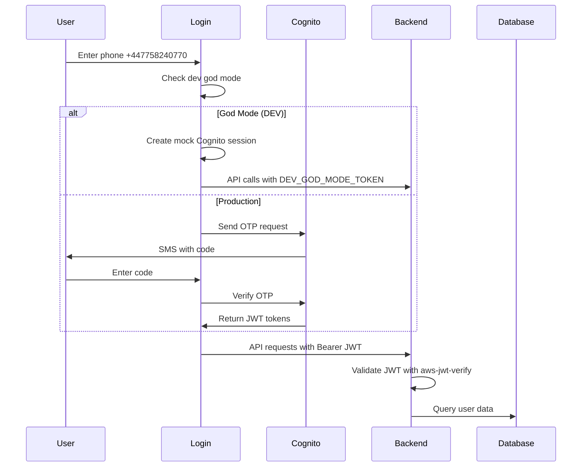
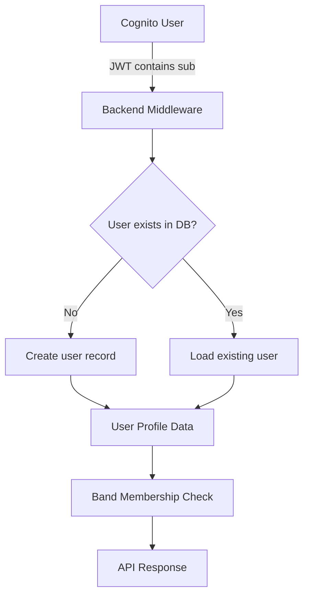

# BNDY Authentication & User Management Architecture

## Current Status: PARTIALLY MIGRATED ⚠️

**Core Components**: ✅ Working with AWS Cognito
**Remaining Components**: ❌ Still using legacy Supabase references
**Basic Flow**: ✅ Login → Dashboard → Profile works
**Calendar**: ❌ Needs migration

---

## Authentication Architecture

### AWS Cognito Implementation

#### User Pool Configuration
- **User Pool ID**: `eu-west-2_LqtkKHs1P`
- **App Client ID**: `5v481th8k6v9lqifnp5oppak89`
- **Region**: `eu-west-2`
- **Authentication Methods**: Phone number (primary), Email, Google OAuth (planned)

#### Development God Mode
- **Phone**: `+447758240770`
- **Code**: Any 6-digit number
- **Token**: `DEV_GOD_MODE_TOKEN`
- **Purpose**: Bypasses Cognito for development testing

### Authentication Flow



### Token Management

#### Cognito Session Structure
```typescript
interface AuthSession {
  user: CognitoUser;
  tokens: {
    accessToken: string;    // For AWS services
    idToken: string;        // For backend API (main token)
    refreshToken?: string;  // For token renewal
  };
}
```

#### Token Usage
- **Frontend**: `session.tokens.idToken` for all API calls
- **Backend**: JWT verification with `aws-jwt-verify`
- **Development**: `DEV_GOD_MODE_TOKEN` bypass

---

## User Management System

### User Data Flow



### Database Schema

#### Users Table
```sql
-- Primary user record (linked to Cognito)
CREATE TABLE users (
  id SERIAL PRIMARY KEY,
  supabase_id TEXT UNIQUE NOT NULL,  -- TODO: Rename to cognito_id
  email TEXT,
  phone TEXT,
  first_name TEXT,
  last_name TEXT,
  display_name TEXT,
  avatar_url TEXT,
  platform_admin BOOLEAN DEFAULT false,
  profile_completed BOOLEAN DEFAULT false,
  created_at TIMESTAMP DEFAULT NOW(),
  updated_at TIMESTAMP DEFAULT NOW()
);
```

#### Band Membership
```sql
-- Band membership and roles
CREATE TABLE user_bands (
  id SERIAL PRIMARY KEY,
  user_id INTEGER REFERENCES users(id),
  band_id INTEGER REFERENCES bands(id),
  role TEXT DEFAULT 'member',  -- 'admin', 'member'
  display_name TEXT,           -- Band-specific display name
  icon TEXT,                   -- Band-specific icon
  color TEXT,                  -- Band-specific color
  joined_at TIMESTAMP DEFAULT NOW(),
  UNIQUE(user_id, band_id)
);
```

### User Context System

#### User Profile Resolution
1. **Authentication**: JWT verified → Cognito user ID extracted
2. **User Lookup**: Find/create user record using `supabaseId` field
3. **Band Resolution**: Load all band memberships for user
4. **Context Creation**: Provide user + bands to React context

#### Band Context Switching
- **Single Band**: Auto-selected
- **Multiple Bands**: User chooses via band-switcher
- **No Bands**: Onboarding flow
- **Storage**: Selected band ID in localStorage

---

## Component Architecture

### ✅ Migrated to Cognito

#### Core Authentication Components
- `client/src/hooks/useCognitoAuth.tsx` - Main auth hook
- `client/src/pages/auth/login.tsx` - Login flow
- `client/src/App.tsx` - Auth provider setup
- `client/src/lib/user-context.tsx` - User management
- `client/src/components/band-gate.tsx` - Route protection

#### API Integration
- `client/src/lib/queryClient.ts` - Centralized API auth
- `server/cognito-auth-middleware.ts` - JWT verification
- `server/routes.ts` - Protected API routes

### ❌ Still Using Supabase (TODO)

#### Navigation Components
- `client/src/components/side-nav.tsx` - Main navigation
- `client/src/components/gig-alert-banner.tsx` - Alert component

#### Page Components
- `client/src/pages/calendar.tsx` - Calendar view
- `client/src/pages/admin.tsx` - Admin interface
- `client/src/pages/songs.tsx` - Song management
- `client/src/pages/onboarding.tsx` - User onboarding

#### Legacy Files
- `client/src/hooks/useSupabaseAuth.tsx` - Old auth hook (DELETE)
- `server/auth-middleware.ts` - Old middleware (DELETE)

---

## API Authentication

### Backend Middleware Flow

```typescript
// server/cognito-auth-middleware.ts
export async function authenticateCognitoJWT(req, res, next) {
  // 1. Extract Bearer token from Authorization header
  const token = req.headers.authorization?.replace('Bearer ', '');

  // 2. Development god mode bypass
  if (process.env.NODE_ENV === 'development' && token === 'DEV_GOD_MODE_TOKEN') {
    req.user = { cognitoId: 'dev-god-mode-user' };
    return next();
  }

  // 3. Verify JWT with aws-jwt-verify
  const payload = await jwtVerify(token, cognitoJwtSecret);

  // 4. Set user context
  req.user = { cognitoId: payload.sub };
  next();
}
```

### API Request Pattern

```typescript
// Frontend API calls (via queryClient)
const response = await fetch('/api/me', {
  headers: {
    'Authorization': `Bearer ${session.tokens.idToken}`,
    'Content-Type': 'application/json',
  }
});
```

---

## Migration Status & TODOs

### Immediate TODOs (Required for Calendar)
1. **Fix calendar.tsx**: Update to use `useCognitoAuth`
2. **Fix side-nav.tsx**: Update to use Cognito tokens
3. **Fix gig-alert-banner.tsx**: Update auth references

### Architectural Improvements (Future)
1. **Remove Direct Auth**: Components shouldn't access auth tokens directly
2. **Data Hooks**: Create React Query hooks for data fetching
3. **Centralize API**: All API calls through queryClient
4. **Clean Schema**: Rename `supabaseId` → `cognitoId`

### Files to Delete (After Migration)
- `client/src/hooks/useSupabaseAuth.tsx`
- `server/auth-middleware.ts`
- `client/src/lib/supabase.ts` (compatibility layer)

---

## Environment Configuration

### Required Environment Variables
```bash
# AWS Cognito Configuration
VITE_COGNITO_USER_POOL_ID=eu-west-2_LqtkKHs1P
VITE_COGNITO_USER_POOL_CLIENT_ID=5v481th8k6v9lqifnp5oppak89
VITE_AWS_REGION=eu-west-2

# Backend Cognito Configuration
COGNITO_USER_POOL_ID=eu-west-2_LqtkKHs1P
COGNITO_USER_POOL_CLIENT_ID=5v481th8k6v9lqifnp5oppak89
AWS_REGION=eu-west-2

# Development
NODE_ENV=development
```

### Development vs Production
- **Development**: God mode bypass with `+447758240770`
- **Production**: Full Cognito OTP flow
- **Testing**: Mock sessions for automated tests

---

## Security Considerations

### JWT Validation
- **Algorithm**: RS256 (asymmetric)
- **Issuer**: AWS Cognito User Pool
- **Audience**: App Client ID
- **Expiration**: 1 hour (configurable)

### Development Security
- **God Mode**: Only enabled in `NODE_ENV=development`
- **Phone Restriction**: Only specific phone number `+447758240770`
- **Token Pattern**: Recognizable `DEV_GOD_MODE_TOKEN`

### Production Hardening
- [ ] Remove all development bypasses
- [ ] Implement proper session refresh
- [ ] Add rate limiting for auth endpoints
- [ ] Enable MFA for admin users
- [ ] Audit log for authentication events

---

## Troubleshooting

### Common Issues
1. **Login doesn't redirect**: Check if dashboard component uses Cognito tokens
2. **API calls fail**: Verify JWT token format (`session.tokens.idToken`)
3. **God mode not working**: Ensure `NODE_ENV=development`
4. **User not found**: Check `supabaseId` field linking

### Debug Steps
1. Check browser network tab for failed API calls
2. Verify JWT token format in Authorization header
3. Check server logs for JWT verification errors
4. Confirm environment variables are loaded

---

*Last Updated: September 24, 2025*
*Migration Status: Core components migrated, remaining components pending*